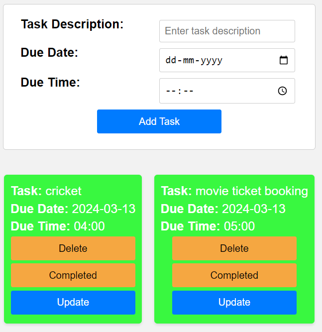
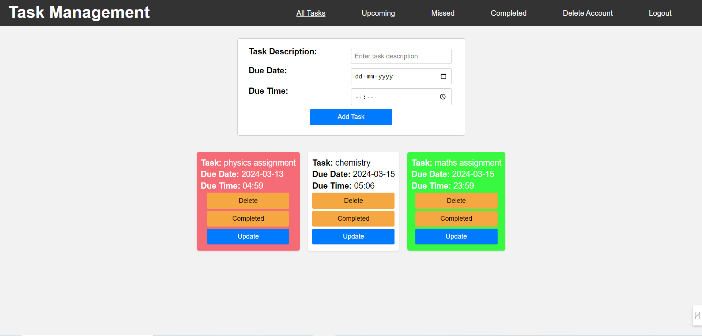

# TASK-MANEGMENT

this project is built with flask as back end and html,css,js as frontend

it has options signup login and upcomming tasks,competed tasks,missed tasks and adding of tasks 

first you need to signup with a user id and password it will redirect to login page 

then you can login with the login id and password

missed task if current time and date is more than the task time then 

upcomming tasks if current time and date is less than the task time that is you have time to complete

completed tasks that is if you cleck completed then it will as task.status to completed

all tasks it will show all the tasks present in the website 

i used local storage for this project 

this is my web page apperarence 

in this page if you log out the data of the account will be stored safe while you want to delete the account then you can delete and it will redirect to home page ("/") and the local storage is cleared 

